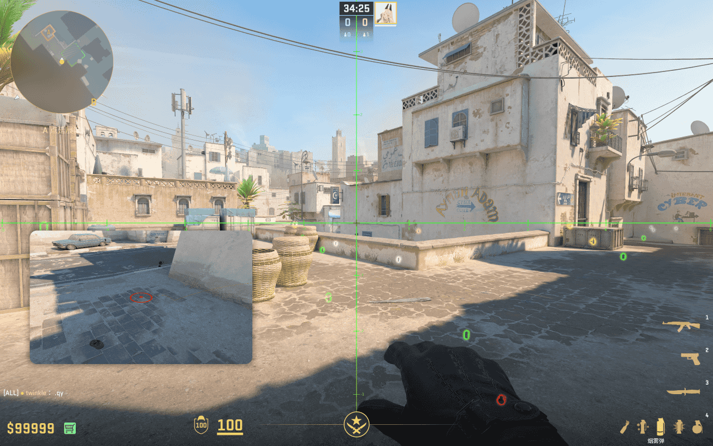
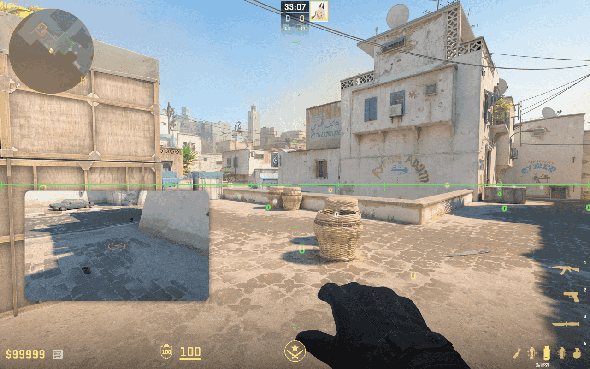

# A 大满封烟

## A 大满封烟（右）

- 简述：从 A 平死角投出的 4.30 秒的 A 大满封烟，仅留右侧缝隙。

- 站点：A 平死角木桶右侧
- 瞄点：墙上电线的十字路口
- 投掷：跳 + 左键投掷
- 时长：4.30 秒
- 作用：落在 A 大中部，仅留右侧缝隙，敌人若从右侧突进，则会面对电梯位、蓝车后和 A 二箱后的交叉火力
- 备注：无

## A 大满封烟（左）

- 简述：从 A 平死角投出的 4.45 秒的 A 大满封烟，仅留左侧缝隙。

- 站点：A 平死角木桶左侧
- 瞄点：墙上电线的十字路口
- 投掷：跳 + 左键投掷
- 时长：4.45 秒
- 作用：落在 A 大中部，仅留左侧缝隙，敌人若从左侧突进，则会面对蓝车和 A 包的交叉火力
