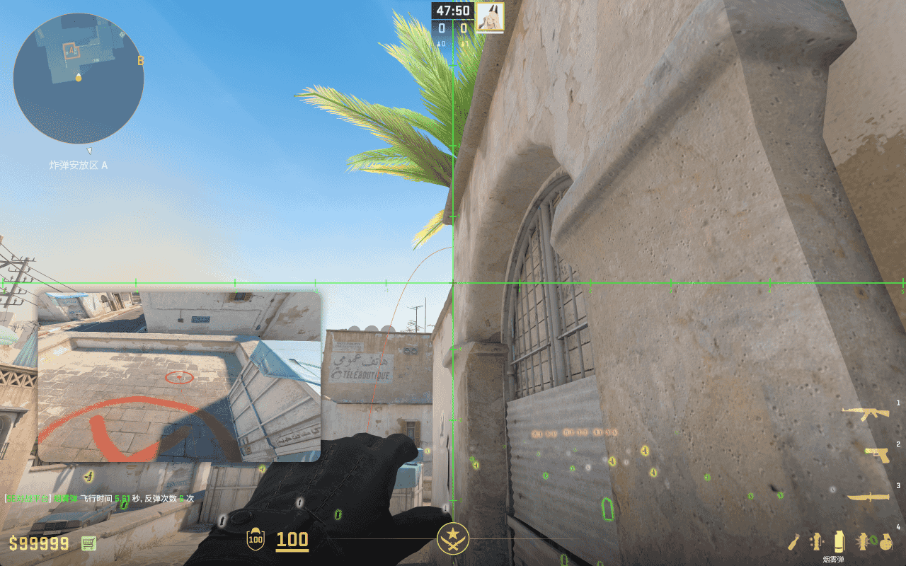

# A 门烟

## A 门快烟 - CT

- 简述：从警家口的小箱左边投出的 7 秒快烟，烟雾覆盖 A 门，阻挡敌人视线。

<!-- <iframe
    width="100%"
    style="max-height: 450px; height: 50vw"
    src="//player.bilibili.com/player.html?bvid=184421Z7DU&&page=1"
    scrolling="no"
    border="0"
    frameborder="no"
    framespacing="0"
    allowfullscreen="true">
</iframe> -->

- 站点：警家口小箱左侧贴墙
- 瞄点：楼顶圆形物左边缘平行往上一段，和左侧杆子尖部齐平
- 投掷：跳 + 左键投掷
- 时长：6.88 秒
- 作用：烟雾覆盖 A 门，阻挡敌人视线
- 备注：瞄点的水平位置可以在标准瞄点和左侧杆子之间微调，爆弹速度会慢 0.8 秒

## A 门快烟 - CT 电梯位

- 简述：从警家电梯位投出的 6 秒快烟，烟雾覆盖 A 门，阻挡敌人视线。

- 站点：警家电梯位
- 瞄点：如图所示
- 投掷：跳 + 左键投掷
- 时长：6.08 秒
- 作用：烟雾覆盖 A 门，阻挡敌人视线
- 备注：如果用前跳投，封的是门内烟，但爆弹略慢

## A 门慢烟 - CT 电梯位

- 简述：从警家电梯位投出的 7 秒慢烟，烟雾覆盖 A 门，阻挡敌人视线。

- 站点：警家电梯位
- 瞄点：如图所示
- 投掷：跳 + 左键投掷
- 时长：7.48 秒
- 作用：烟雾覆盖 A 门，阻挡敌人视线
- 备注：无

## A 门烟 - 鹅位

- 简述：从 A 点鹅位投出的 5 秒快烟，烟雾覆盖 A 门，阻挡敌人视线。

- 站点：警家电梯位
- 瞄点：待补充
- 投掷：跳 + 左键投掷
- 时长：5.58 秒
- 作用：烟雾覆盖 A 门，阻挡敌人视线
- 备注：一般是 A 包的人帮守 A 大没带烟的人投的烟
