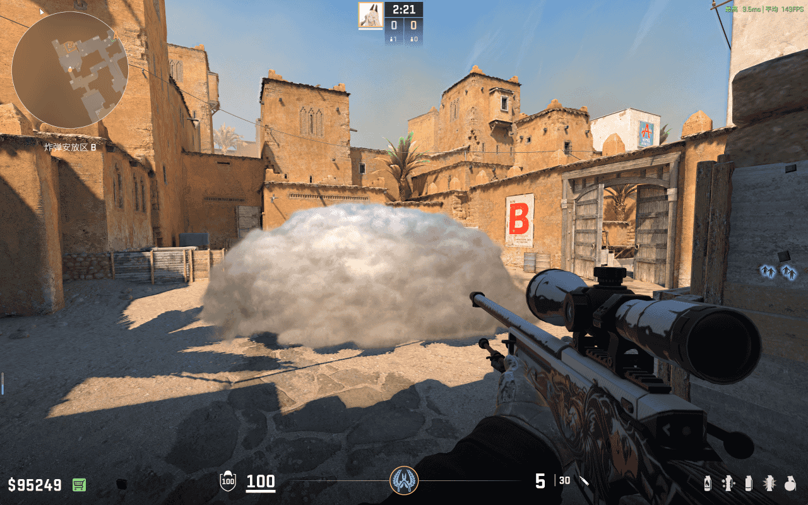
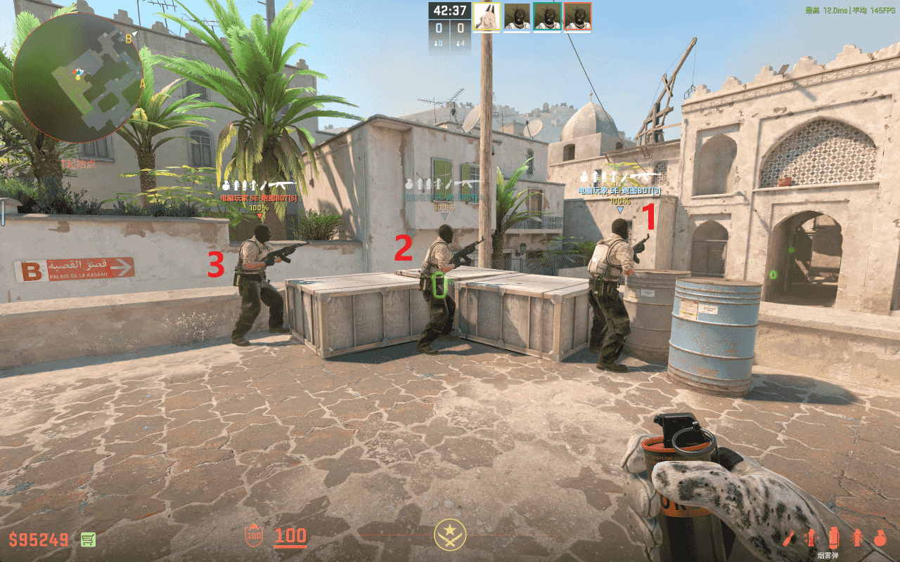
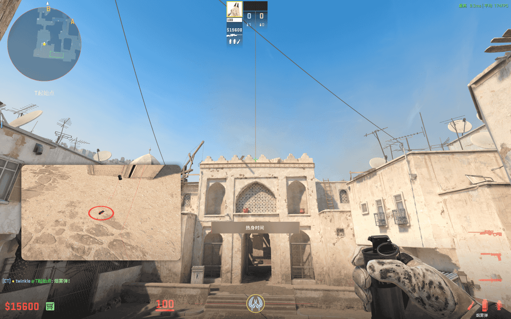
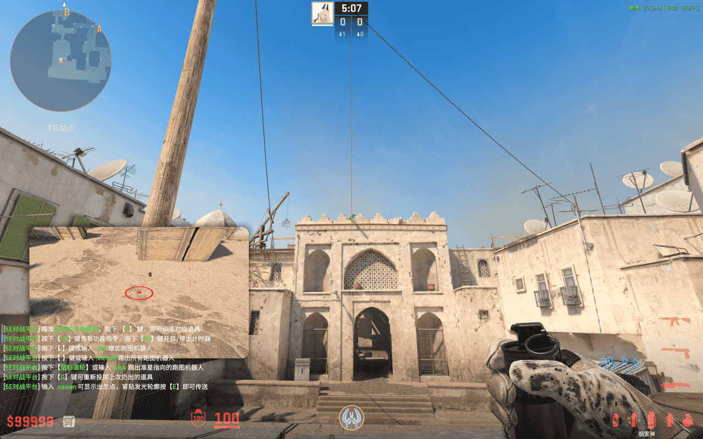
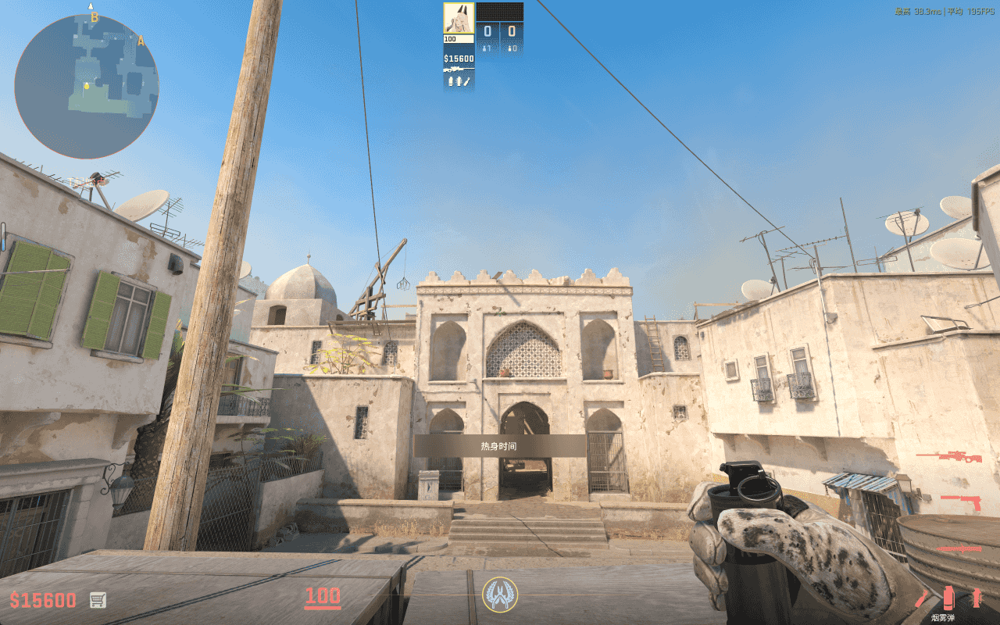
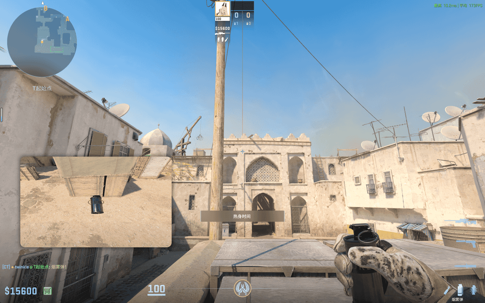
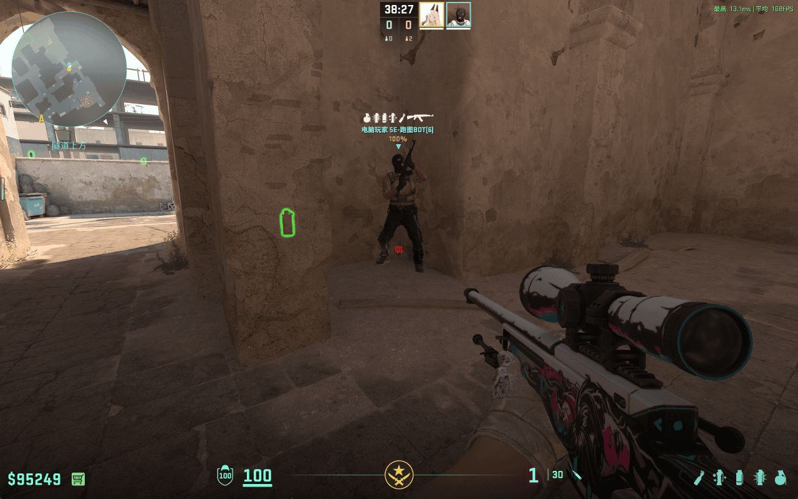
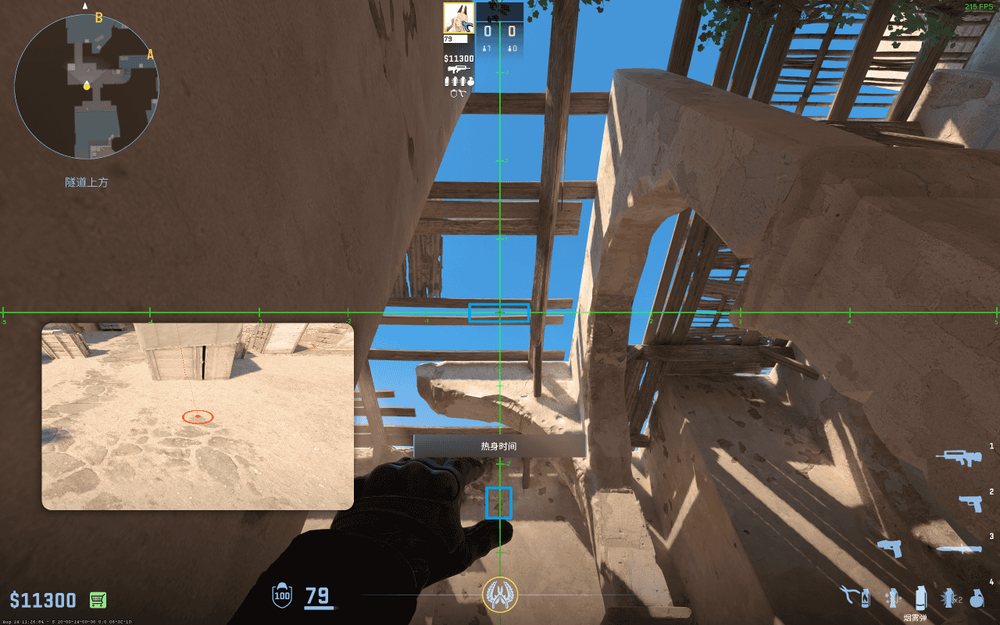

# B 大箱隔断烟

落在炙热沙城 B 点大箱前的烟雾弹，可以阻隔大箱和死角的视线，为队友提供掩护。

## B 大箱隔断烟 - 足球场

- 站点：如图，标号 1 的身位
- 瞄点：如图所示
- 投掷：跳 + 左键投掷
- 时长：6.70 秒
- 作用：略
- 备注：无

## B 大箱隔断烟 - 足球场 2

- 站点：如图，标号 2 的身位
- 瞄点：如图所示
- 投掷：跳 + 左键投掷
- 时长：6.61 秒
- 作用：略
- 备注：无

## B 大箱隔断烟 - 足球场 3

- 站点：如图，标号 2 的身位
- 瞄点：如图所示
- 投掷：跳 + 左键投掷
- 时长：7.56 秒
- 作用：略
- 备注：无

## B 大箱隔断烟 - 足球场 4

- 站点：如图，标号 3 的身位
- 瞄点：如图所示，污渍
- 投掷：跳 + 左键投掷
- 时长：7.89 秒
- 作用：略
- 备注：无

## B 大箱隔断烟 - B2

- 站点：B2 角落
- 瞄点：如图所示，准星 x 轴置于缝隙内，y 轴与下方蓝框内的污渍右端对齐
- 投掷：左键投掷
- 时长：5.12 秒
- 作用：略
- 备注：无
