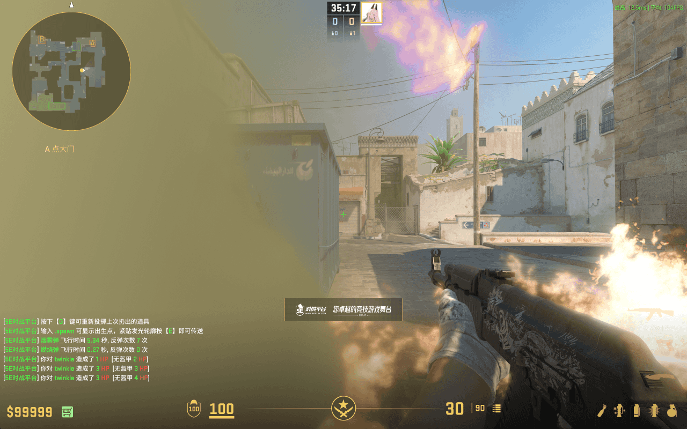
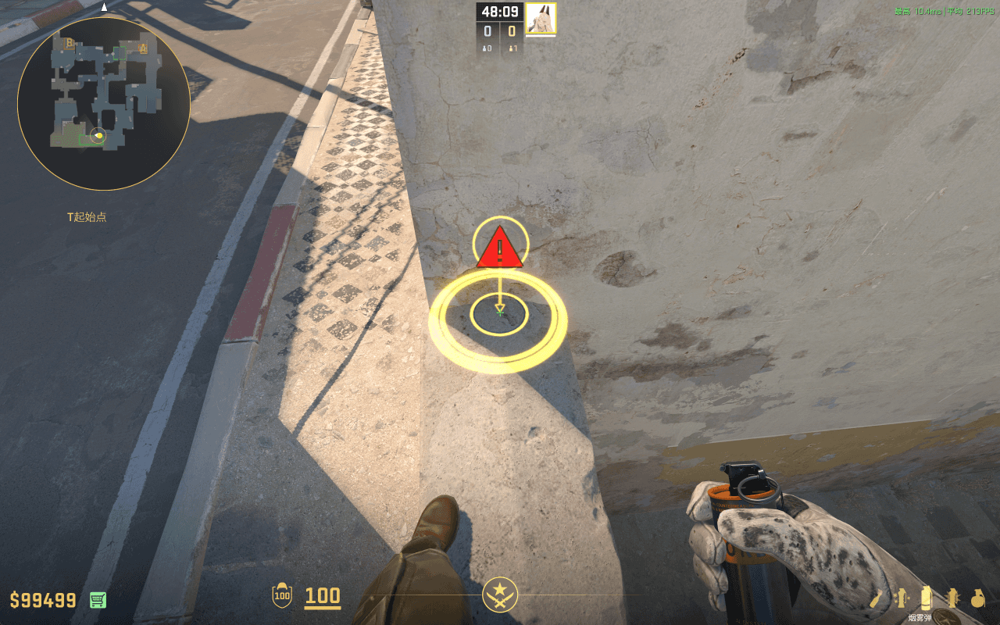
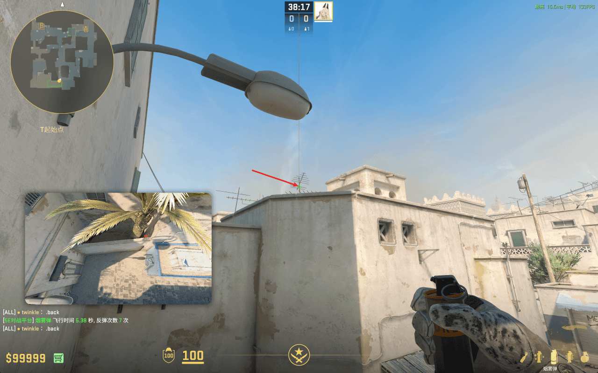

# 蓝箱灭火烟

落在蓝箱后墙壁左侧，用以熄灭 CT 方丢的蓝箱火，帮助一突躲到蓝箱后，让他能掩护其他队友出 A 门。

## 蓝箱灭火烟 - 暗道上方

- 站点：如图，暗道上方
- 瞄点：蹲着，瞄点如图所示
- 投掷：蹲 + 跳 + 左键投掷
- 时长：5.12 秒
- 作用：熄灭 CT 方丢的蓝箱火，帮助一突躲到蓝箱后
- 备注：**理论**效果最好的 Xbox 烟，对 B1 和 沙地的遮蔽效果都极佳
