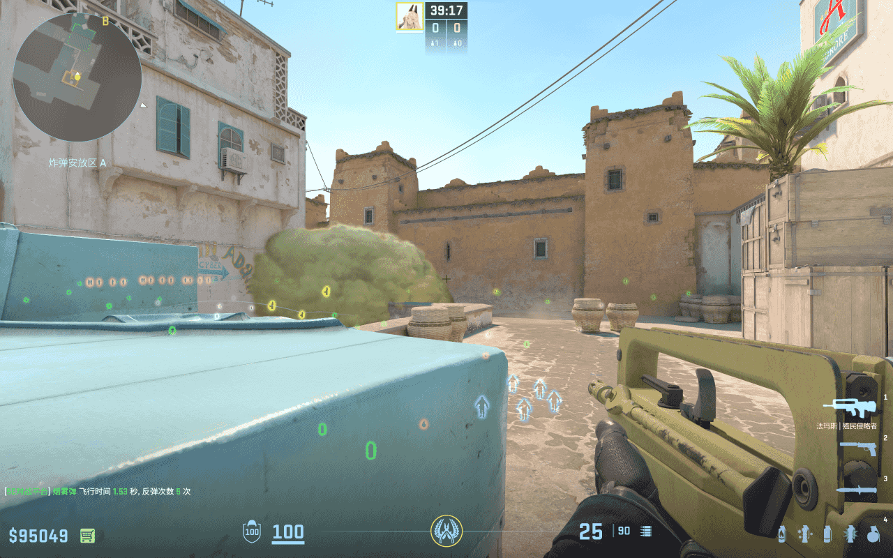
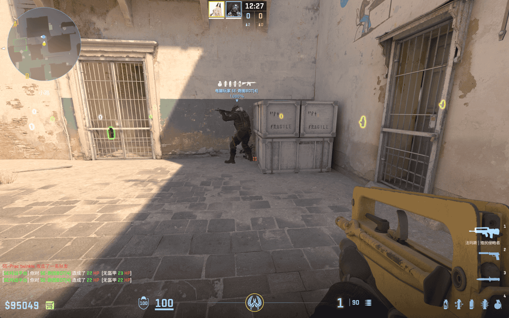
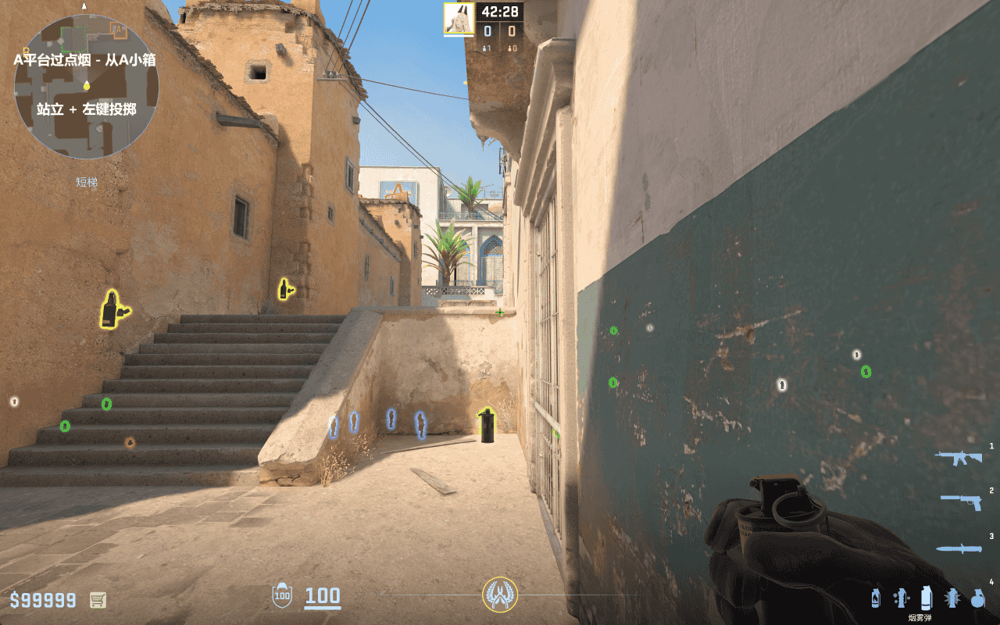
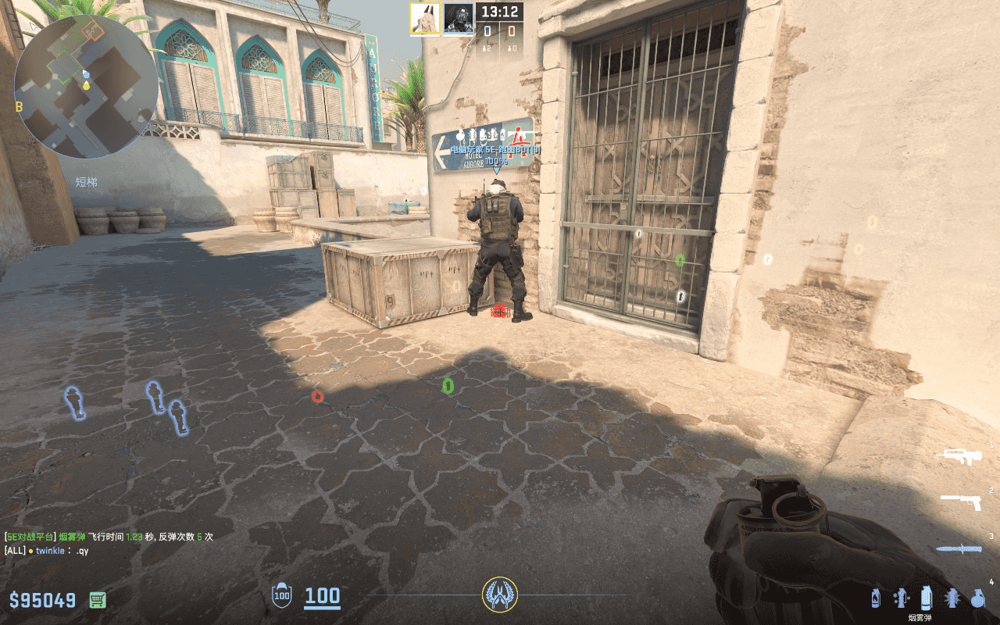
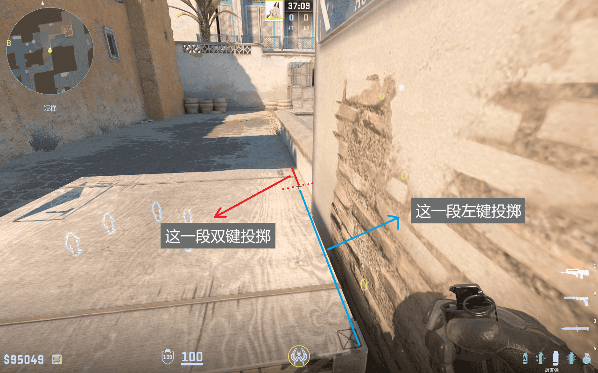
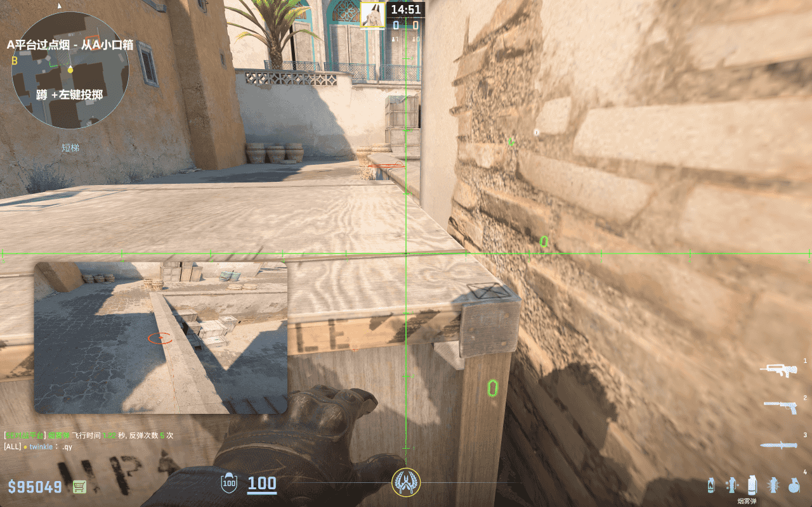
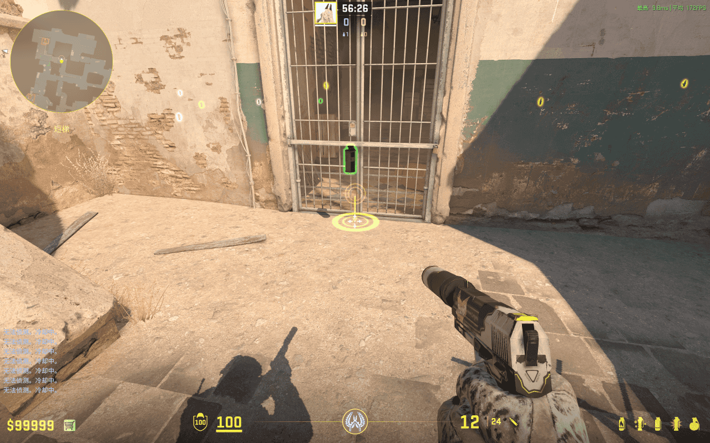
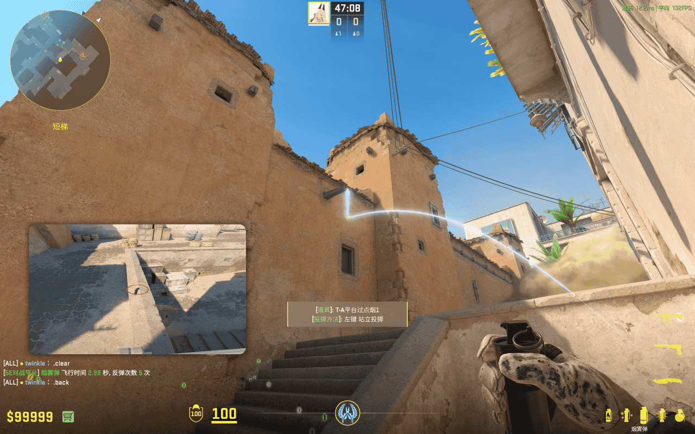
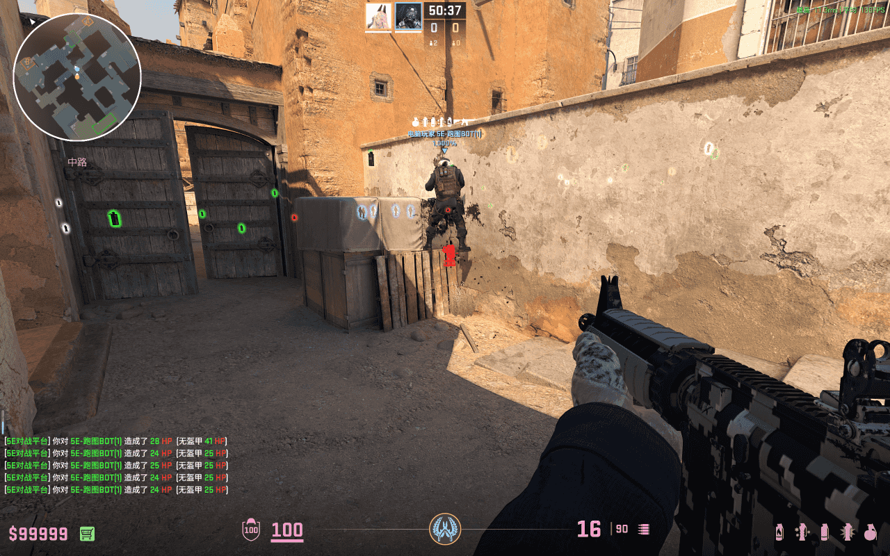
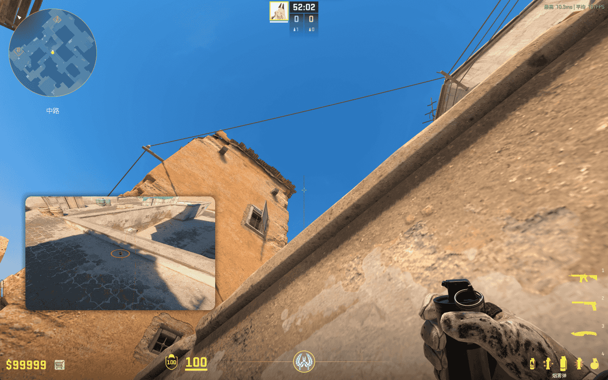

# A 平台过点烟

落在 A 小口的烟，阻碍自 A 包和蓝车的架枪视线，掩护我方进入 A 平台。配合一颗 A 平台转角烟 和 A 包火，可以一路掩护我方抵达 A 近点。

## A 平台过点烟 - A 小箱

- 简述：从 A 小箱投出的 x 秒的 A 平台过点烟，阻碍自 A 包和蓝车的架枪视线

- 站点：A 小箱前方
- 瞄点：如图所示
- 投掷：站立 + 左键投掷
- 时长：1.50 秒
- 作用：落在 A 小口，阻碍自 A 包和蓝车的架枪视线，掩护我方进入 A 平台
- 备注：暂无

## A 平台过点烟 - A 小口箱

- 简述：从 A 小口箱投出的 A 平台过点烟，阻碍自 A 包和蓝车的架枪视线

- 站点：A 小箱前方
- 瞄点：如图所示
- 投掷：瞄点 1：如图所示 / 瞄点 2：蹲 + 左键投掷
- 时长：1.30 ~ 1.90 秒
- 作用：落在 A 小口，阻碍自 A 包和蓝车的架枪视线，掩护我方进入 A 平台
- 备注：瞄点 1 越往上，烟雾越靠外，但实际效果相差很小。瞄点 2 要求准星坐标 y 轴与忍者位箱子的中线重合，x 轴与 A 小口箱子上的横向重合，理论上瞄点 2 的效果最佳，因为烟雾会更靠外，和墙壁留有足够的空隙，有利于我方上 A 平台时调整持枪视角。

## A 平台过点烟 - A 小假门

- 简述：从 A 小假门投出的 A 平台过点烟，阻碍自 A 包和蓝车的架枪视线

- 站点：Xbox 二层贴墙
- 瞄点：如图所示，在房檐角右侧一段距离即可
- 投掷：左键投掷
- 时长：2.89 秒
- 作用：落在 A 小口，阻碍自 A 包和蓝车的架枪视线，掩护我方进入 A 平台
- 备注：这个位置一般是由中路最后的队友或者从 B1 来汇合的队友投掷。

## A 平台过点烟 - Xbox

- 简述：从 Xbox 投出的 A 平台过点烟，阻碍自 A 包和蓝车的架枪视线

- 站点：Xbox 二层贴墙
- 瞄点：如图所示，在房檐角右侧一段距离即可
- 投掷：左键投掷
- 时长：7.32 秒
- 作用：落在 A 小口，阻碍自 A 包和蓝车的架枪视线，掩护我方进入 A 平台
- 备注：这个位置一般是由中路最后的队友或者从 B1 来汇合的队友投掷。
