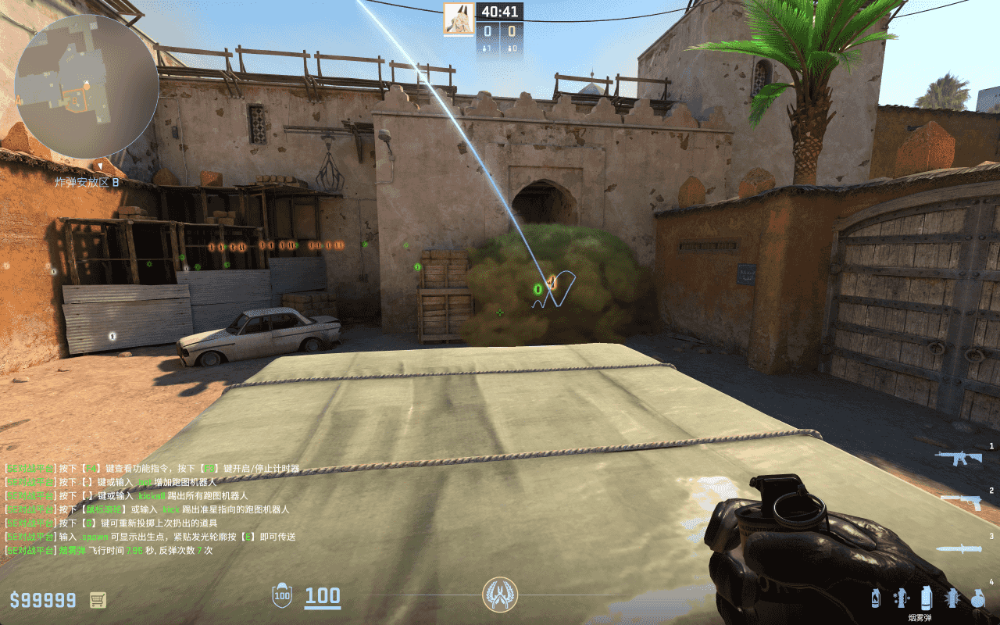
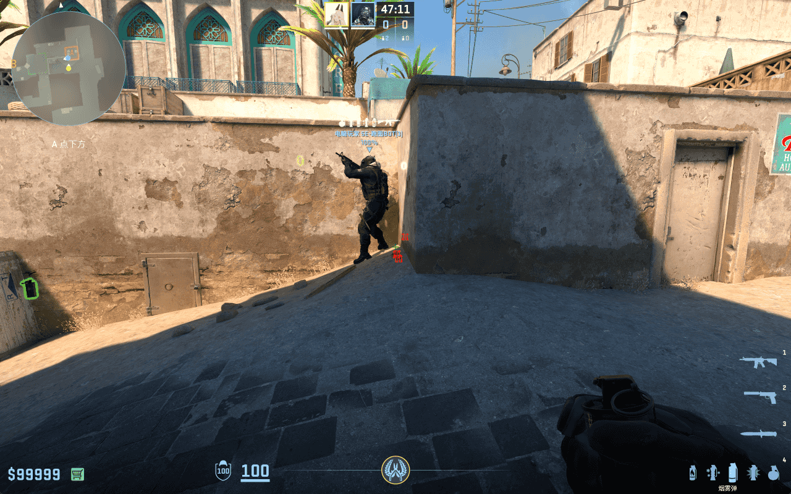
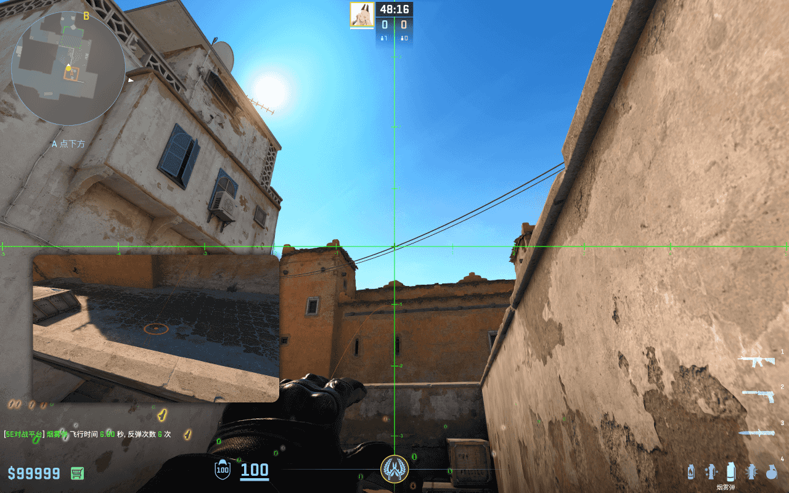
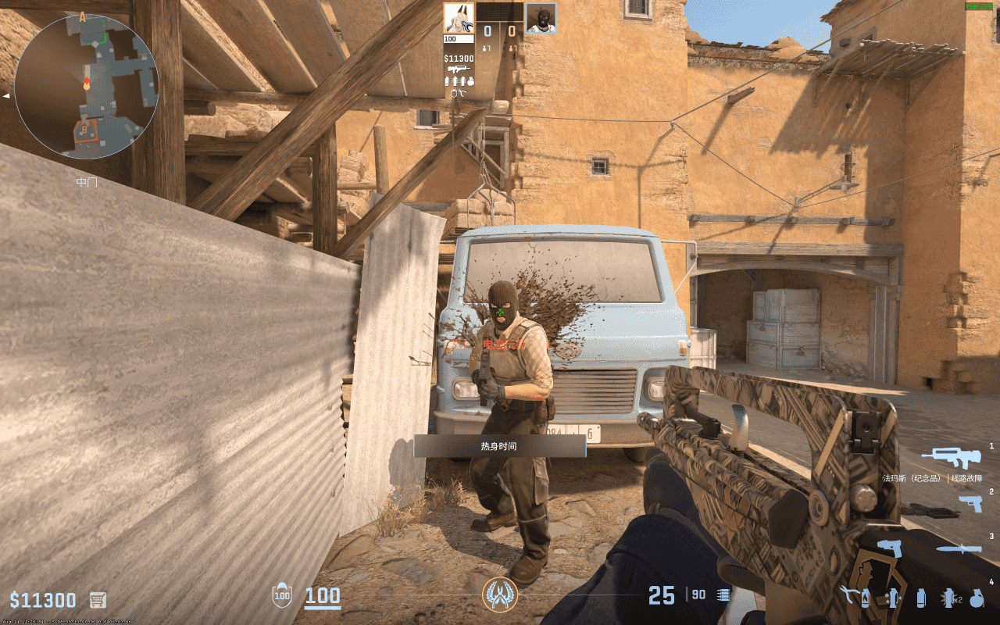
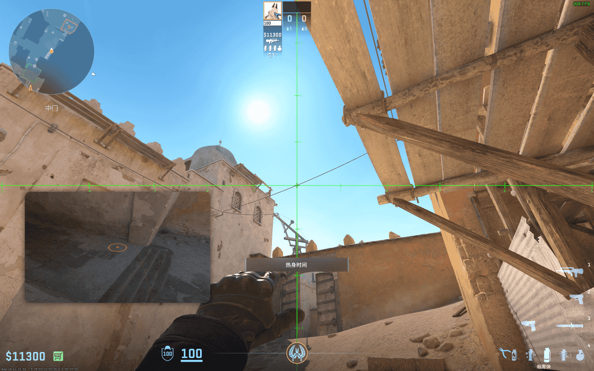
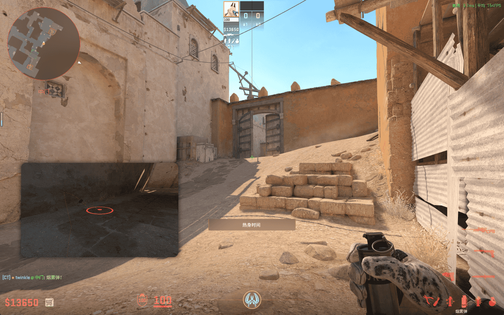

# B 通烟

## B 通烟 - 电梯位

- 站点：警家电梯位
- 瞄点：准星 y 轴与墙上第二扇窄窗左边缘重合，准星中心放到上方最高的电线上
- 投掷：静步前进一步 + 跳 + 左键投掷
- 时长：7.95 秒
- 作用：烟雾覆盖 B 通口，阻挡敌人视线
- 备注：在 A 的队友远程支援 B 点防守时使用

## B 通烟 - 卡车头

- 站点：卡车头
- 瞄点：准星 y 轴与卡车头顶缘重合，准星中心放到卡车头顶缘
- 投掷：左键投掷
- 时长：4.12 秒
- 作用：烟雾覆盖 B 通口，阻挡敌人视线
- 备注：在沙地的队友远程支援 B 点防守时使用

## B 通烟 - 卡车头 2

- 站点：卡车头
- 瞄点：蹲下来，准星对准左扇门的右下角
- 投掷：左键投掷
- 时长：4.06 秒
- 作用：烟雾覆盖 B 通口，阻挡敌人视线
- 备注：比上一种烟丢的更深，更方便 B 点队友架烟。
