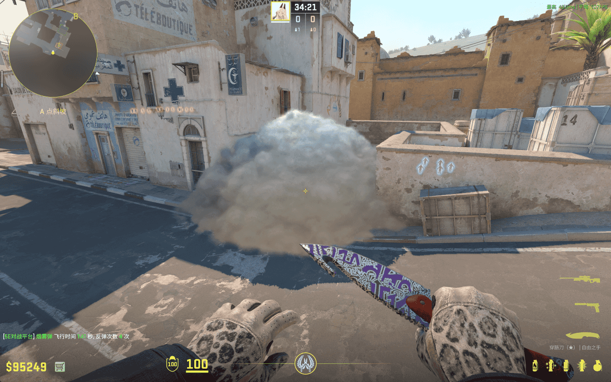
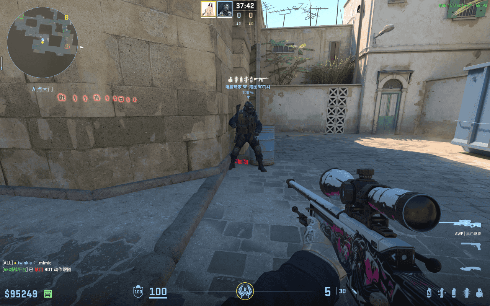
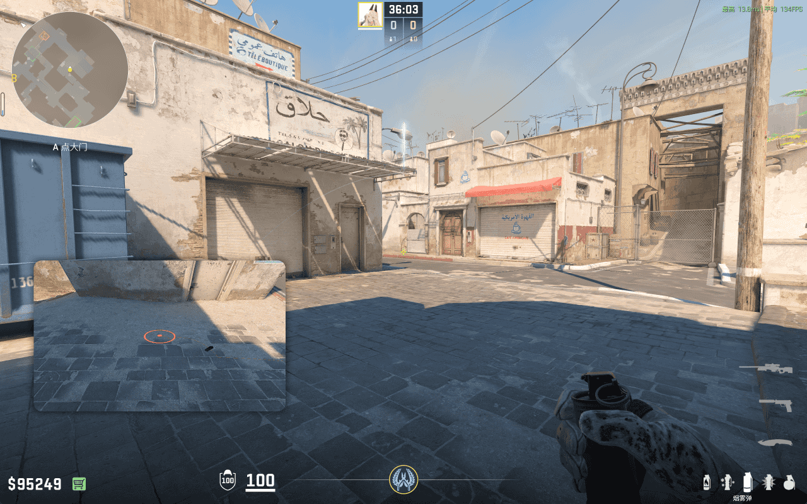
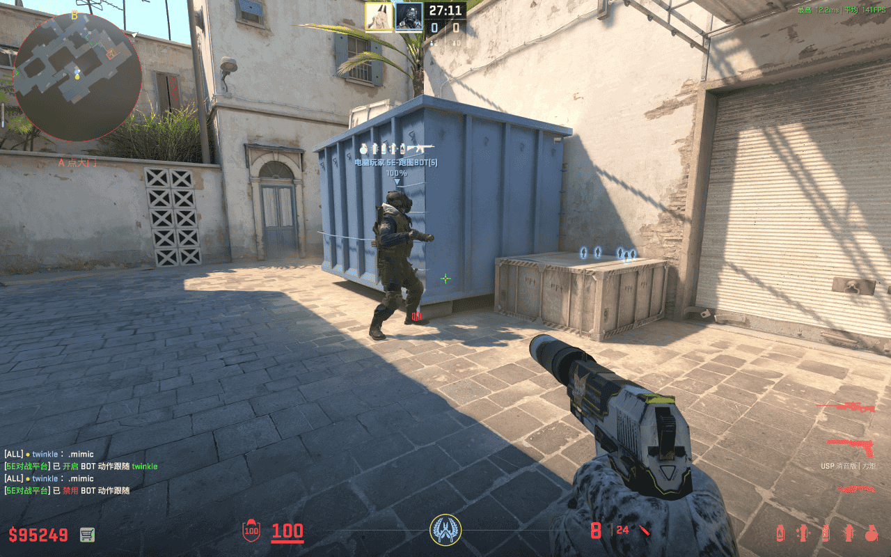
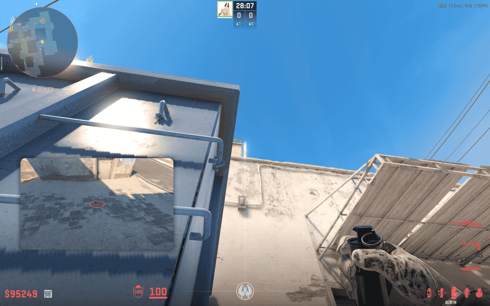
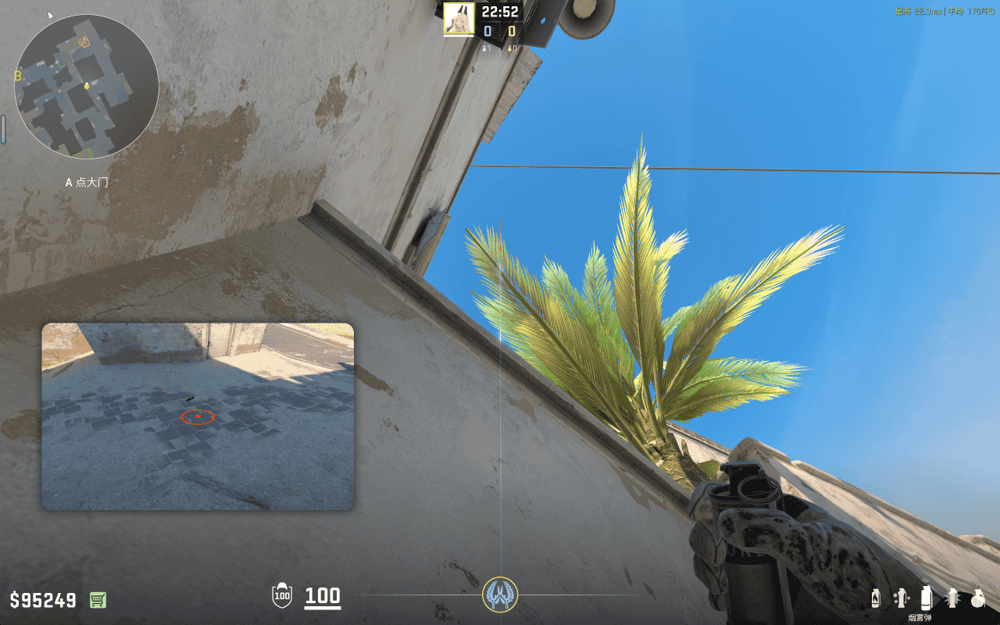

# CT 过点烟

## CT 过点烟 - 油桶

- 站点：如图后背贴紧油桶
- 瞄点：如图所示，准星区域附近即可，不需要精确
- 投掷：W 跑一步 + 跳 + 左键投掷
- 时长：4.6 秒
- 作用：烟雾覆盖 A 大 CT 过点，阻挡 CT 和沙地的视线，以及 A 包对 A 大贴墙的视野
- 备注：无

## CT 过点烟 - 蓝箱

- 站点：如图贴蓝箱边缘
- 瞄点：如图所示
- 投掷：左键投掷
- 时长：5.62 秒
- 作用：烟雾覆盖 A 大 CT 过点，阻挡 CT 和沙地的视线，以及 A 包对 A 大贴墙的视野
- 备注：很简单，高容错率

## CT 过点烟 - 蓝箱后墙角

- 站点：蓝箱后边的墙角
- 瞄点：如图所示，树叶中线
- 投掷：跳 + 左键投掷
- 时长：8.34 秒
- 作用：烟雾覆盖 A 大 CT 过点，阻挡 CT 和沙地的视线，以及 A 包对 A 大贴墙的视野
- 备注：慢，建议靠近叶尖部
