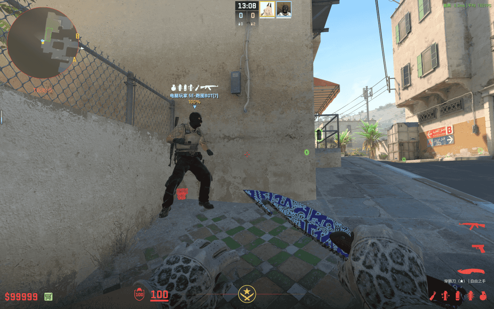
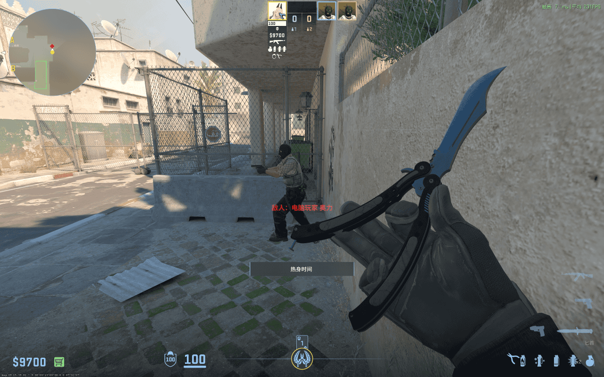
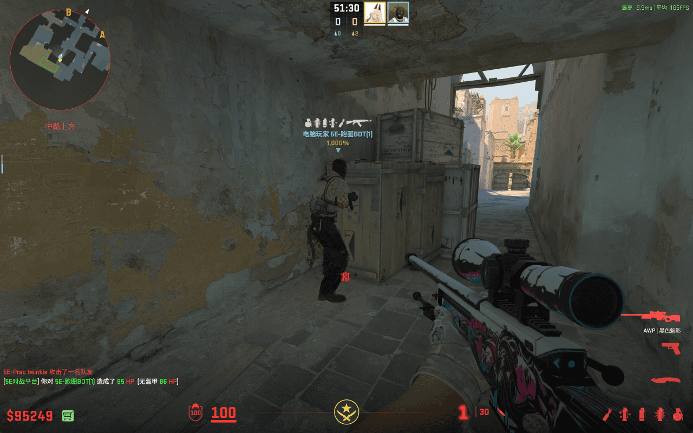

# 中门烟

## 中门烟 - A 平台

- 站点：A 平台靠近狙位的油桶
- 瞄点：如图所示，第四个铆钉
- 投掷：跳 + 左键投掷
- 时长：5.56 秒
- 作用：烟雾覆盖中门，阻挡敌人视线
- 备注：提前攻下 A 平的 T 方可用于掩护中路队友上 A；T 方不要随便丢这个烟，不然吃亏的是自己

## 中门烟 - A 二箱后

- 站点：A 点二箱后
- 瞄点：如图所示，蓝框区域内即可
- 投掷：跳 + 左键投掷
- 时长：5.50 秒
- 作用：烟雾覆盖中门外围，阻挡敌人视线
- 备注：用于警家或沙地的 CT 发现 T 方封了警家烟时，立刻让 A 平的队友扔这个烟，防止 T 方快速进入沙地。也可以是 T 方拿下 A 点后投掷，让从 B 点回防的 T 方只能走警家回防，可以获得优势枪位。

## 中门烟 - 快烟 - 出生位 1

- 站点：T 出生位 1
- 瞄点：如图所示
- 投掷：跳 + 左键投掷
- 时长：4.95 秒
- 作用：烟雾满封中门，阻挡敌人视线
- 备注：超快！用于 T 方开局提速 A 小

## 中门烟 - 快烟 - 出生位 3

- 站点：T 出生位 3
- 瞄点：如图所示
- 投掷：跳 + 左键投掷
- 时长：5.97 秒
- 作用：烟雾满封中门，阻挡敌人视线
- 备注：用于 T 方开局提速 A 小

## 中门烟 - 快烟 - 出生位 4

- 站点：T 出生位 4
- 瞄点：如图所示，深色区域内右上角
- 投掷：跳 + 左键投掷
- 时长：5.97 秒
- 作用：烟雾满封中门，阻挡敌人视线
- 备注：用于 T 方开局提速 A 小

## 中门烟 - 匪家后点 - 1

- 站点：匪家后点
- 瞄点：如图所示
- 投掷：跳 + 左键投掷
- 时长：5.23 秒
- 作用：烟雾满封中门，阻挡敌人视线
- 备注：用于 T 方开局提速 A 小

## 中门烟 - 匪家后点 - 2

- 站点：匪家后点 2
- 瞄点：如图所示，箭头所指的污渍
- 投掷：跳 + 左键投掷
- 时长：5.98 秒
- 作用：烟雾满封中门，阻挡敌人视线
- 备注：用于 T 方开局提速 A 小

## 中门烟 - 匪家角

- 站点：匪家角落
- 瞄点：建筑的右上角
- 投掷：W + 跳 + 左键投掷
- 时长：6.70 秒
- 作用：烟雾覆盖中门内侧，阻挡敌人视线
- 备注：烟上层较薄，可能会漏缝和被穿透

## 中门烟 - 黄车后

- 站点：匪家黄车后的角落
- 瞄点：第一颗黑点
- 投掷：跳 + 左键投掷
- 时长：x6.61 秒
- 作用：烟雾覆盖中门内侧，阻挡敌人视线
- 备注：烟上层较薄，可能会漏缝和被穿透

## 中门烟 - 匪口 - 雨棚下

- 站点：匪口雨棚下，抵住箱子
- 瞄点：如图小缺口，往坐上平移一点
- 投掷：蹲 + 跳 + 左键投掷
- 时长：9.16 秒
- 作用：烟雾覆盖中门内侧，阻挡敌人视线
- 备注：烟上层较薄，可能会漏缝和被穿透

## 中门烟 - A 门外

- 站点：A 门外，抵住墙
- 瞄点：如图，准星置于天线尖部
- 投掷：左键投掷
- 时长：7.12 秒
- 作用：烟雾覆盖中门内侧，阻挡敌人视线
- 备注：烟上层较薄，可能会漏缝和被穿透

## 中门烟 - 暗道

- 站点：暗道
- 瞄点：如图
- 投掷：左键投掷
- 时长：4.61 秒
- 作用：烟雾覆盖中门内侧，阻挡敌人视线
- 备注：无
