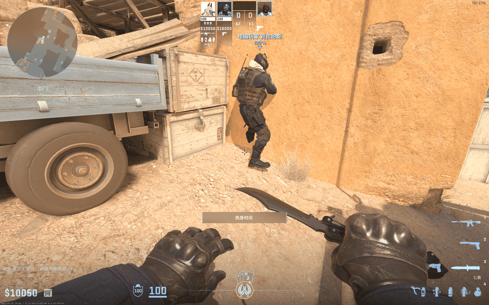
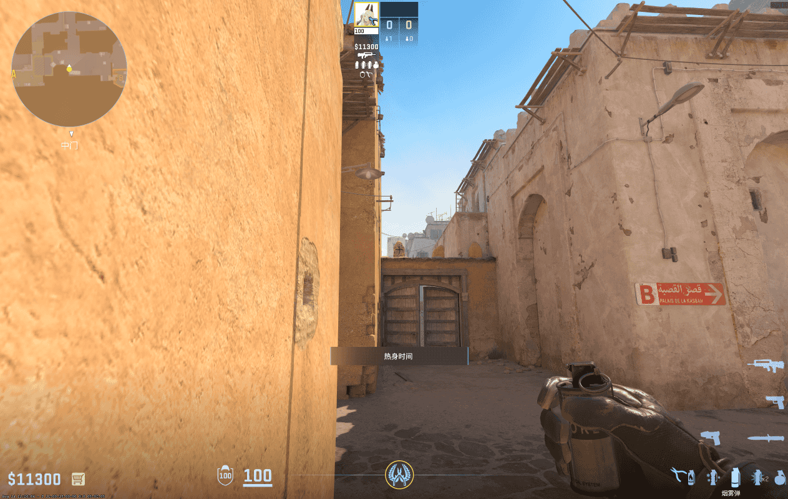
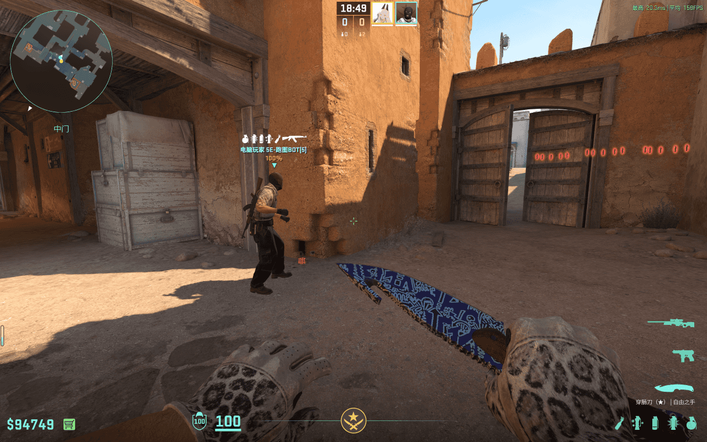
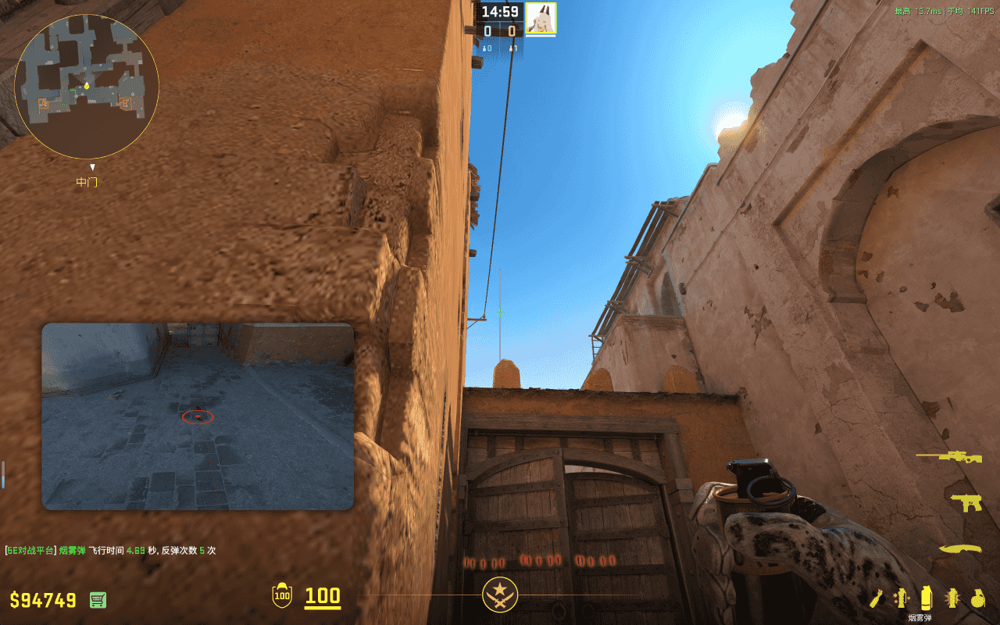
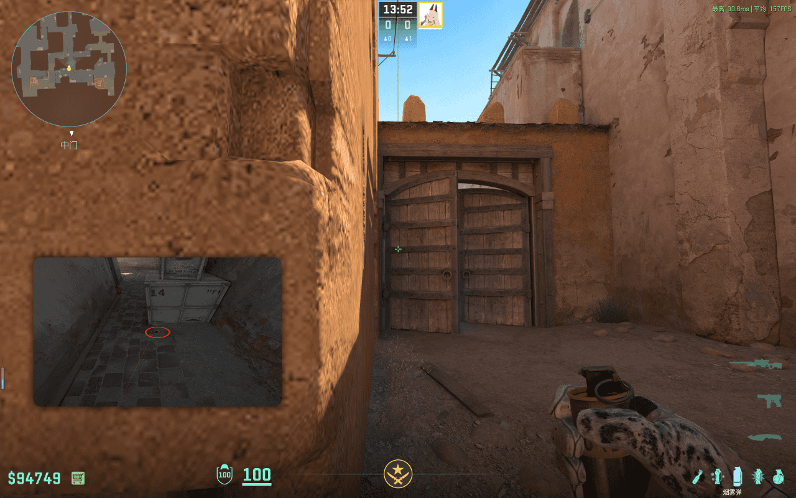
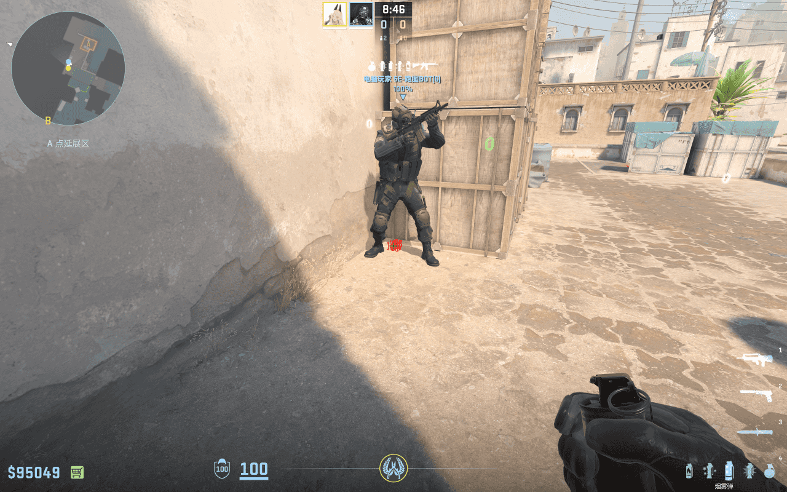
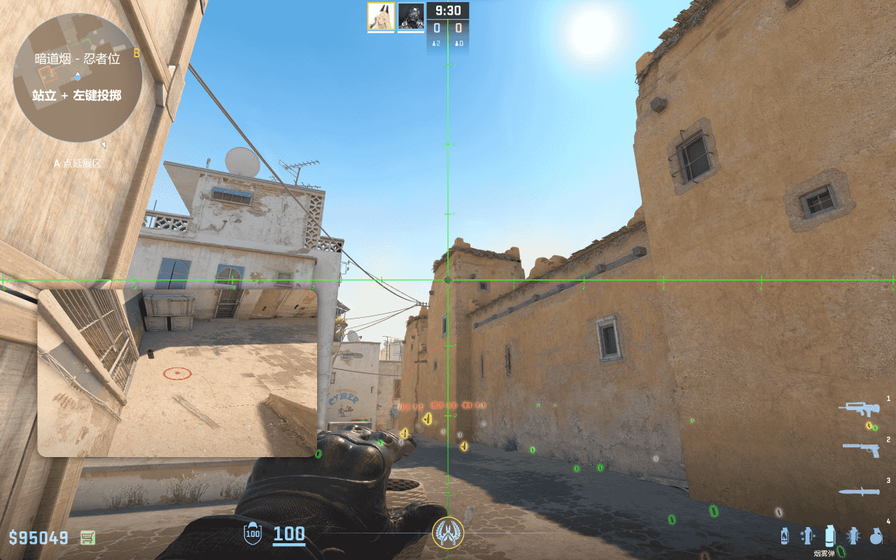

# 暗道烟

## 暗道烟 - 沙地

- 简述：从沙地投出的的暗道烟，阻碍敌方狙击手视线。

- 站点：CT 往沙地走出的墙角
- 瞄点：如图所示，沙块区域
- 投掷：跳 + 左键投掷
- 时长：5.53 秒
- 作用：落在暗道口，阻碍敌方狙击手视线，使其无法狙击穿越中门的队友，以及侦查敌方动向
- 备注：常用于 CT 开局掩护队友从沙地经过中门去 B 点，或者 T 开局中路前压

## 暗道烟 - CT

- 简述：从 CT 口 投出的暗道烟，阻碍敌方狙击手视线。

- 站点：CT 往沙地走出的墙角
- 瞄点 1：如图所示，准星置于沙块区域上方，高一点
- 投掷：左键投掷
- 时长：4.62 秒
- 瞄点 2：如图所示，准星置于中门第三条横杠上，准星 y 轴在上方沙块左侧，避免投掷时被沙块挡住
- 投掷：跳 + 左键投掷
- 时长：4.64 秒
- 作用：落在暗道口，阻碍敌方狙击手视线，使其无法狙击穿越中门的队友，以及侦查敌方动向
- 备注：常用于 CT 开局掩护队友从沙地经过中门去 B 点，或者 T 开局中路前压

## 暗道烟 - 忍者位

- 简述：从 A 平忍者位投出的暗道烟，阻碍敌方狙击手视线。

- 站点：A 平忍者位
- 瞄点：如图所示
- 投掷：跳 + 左键投掷
- 时长：6.30 秒
- 作用：落在暗道口，阻碍敌方狙击手视线，使其无法狙击穿越中门的队友，以及侦查敌方动向
- 备注：可用于 CT 中局掩护队友从沙地回放 B 点，但更建议使用中门烟
